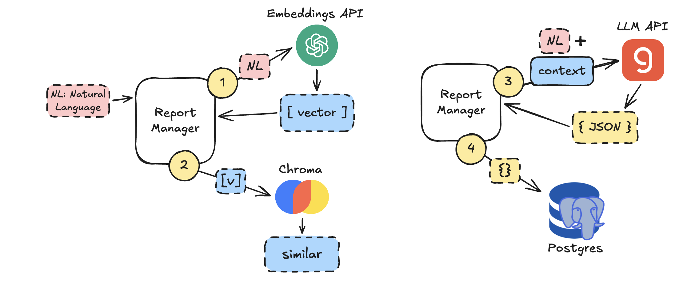
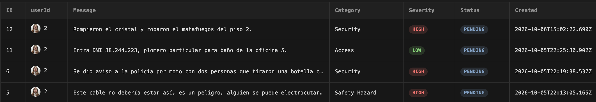

# AI Reports Manager

⚠️ WIP: Learning...

Playground for classifying field security reports from natural language: the system assigns **category** and **severity**, stores the model output, and (in the full pipeline) can detect semantic duplicates before persisting.

## Flow

### 1️⃣ Natural language → embedding

* The report arrives in natural language and is converted into a vector using the OpenAI embeddings API.

### 2️⃣ Vector store + similarity search

* The vector is stored in **Chroma DB** (vector database). A query then retrieves semantically similar reports.

### 3️⃣ Groq with original input + similar context

* We send to **Groq**:
  * the original natural-language input
  * context from the similar reports found in the vector store

* Groq receives the available categories and decides both the **category** and the **severity** of the report.

### 4️⃣ Persist the response

* The model response is saved in the database.

With semantic similarity against existing reports, we can **spot duplicates before inserting** into Postgres.

Groq is responsible for structured classification (category + severity).

